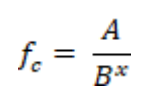
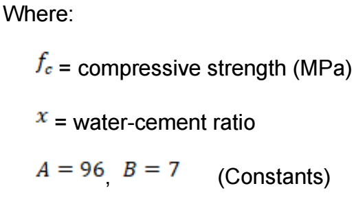
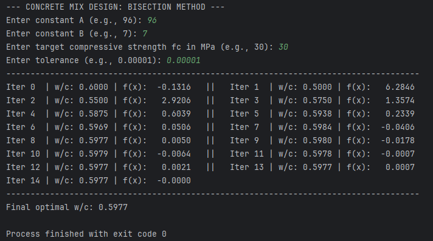
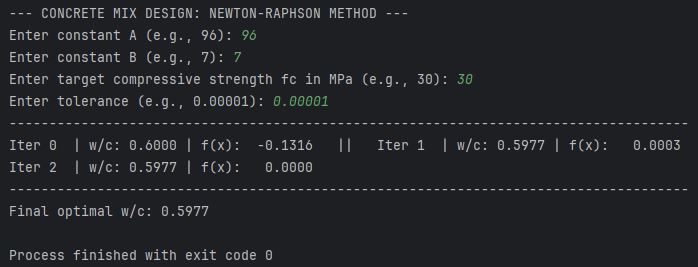

# Optimization of Concrete Mix Proportions

This repository contains two Python scripts used to calculate the optimal water-cement (w/c) ratio for a target concrete compressive strength. The screen will display the results of each calculation step side-by-side to save scrolling space. At the very bottom, it will print the final, optimized w/c ratio.

##  

## 1. Bisection Method

### What This Script Does

This method finds the optimal w/c ratio by taking a starting range (0.4 to 0.8) and repeatedly chopping it in half. It tests the midpoint, decides which half holds the correct answer, and discards the other half. It narrows down the search area until it pinpoints the exact w/c ratio that gives the required concrete strength.

### User Inputs

When you run the script, it will pause and ask you to type in four things:

-   **Constant A:** The material constant (e.g., 96).
-   **Constant B:** The material constant (e.g., 7).
-   **Target Strength (fc):** The required strength in MPa (e.g., 30).
-   **Tolerance:** How precise the final answer needs to be (e.g., 0.00001).

### Expected Output

The screen will display the results of each calculation step side-by-side to save scrolling space. At the very bottom, it will print the final, optimized w/c ratio.

### How the Code Works

-   **Getting Inputs:** The `input()` commands let the user type in their specific project numbers.
-   **The Formula:** We use `def f(x):` to program our main concrete design formula into the computer.
-   **The Setup:** We set our initial high and low guesses (0.4 and 0.8). We also create a blank list (`results = []`) to temporarily save our text so we can format it nicely at the end.
-   **The Loop:** A `while` loop runs the math continuously. It calculates the exact middle of our bracket, checks if the true answer is in the lower half or the upper half, and shrinks the boundaries. It only stops when the bracket size drops below our tolerance.
-   **Formatting the Output:** A final loop takes all the saved text and prints it out two-by-two in a neat grid.

---

## 2. Newton-Raphson Method

### What This Script Does

This method is a much faster mathematical shortcut. Instead of a high/low bracket, it uses a single starting guess (0.6) and calculates the slope (derivative) of the equation to instantly point the computer directly toward the correct w/c ratio.

### User Inputs

The script asks for the exact same inputs as the Bisection method:

-   **Constant A:** The material constant (e.g., 96).
-   **Constant B:** The material constant (e.g., 7).
-   **Target Strength (fc):** The required strength in MPa (e.g., 30).
-   **Tolerance:** How precise the final answer needs to be (e.g., 0.00001).

### Expected Output

This will print a similar side-by-side table, but you will notice it takes far fewer calculation steps to find the final answer because the method is more efficient.

### How the Code Works

-   **Math Library:** We import the `math` toolset at the very top so the computer knows how to calculate natural logarithms.
-   **The Formulas:** We define two equations: `f(x)` for the original strength equation, and `df(x)` for its derivative (the slope).
-   **The Setup:** We start with a single, standard w/c ratio guess of 0.6.
-   **The Loop:** A `while` loop uses the Newton-Raphson formula to predict a much better guess. It compares the old guess to the new guess. If the difference between them is practically zero (below our tolerance), the script knows it has found the answer and stops.
-   **Formatting the Output:** Just like the first script, it prints the saved steps neatly in two columns and reveals the final w/c ratio.